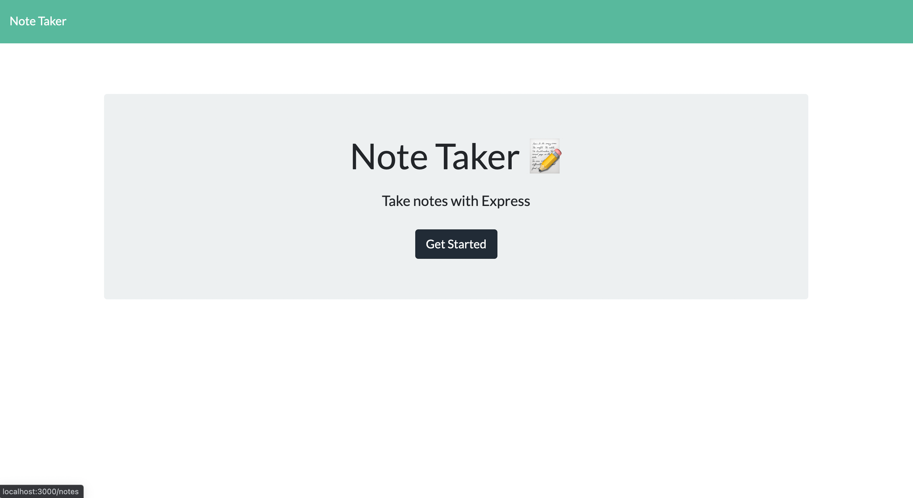
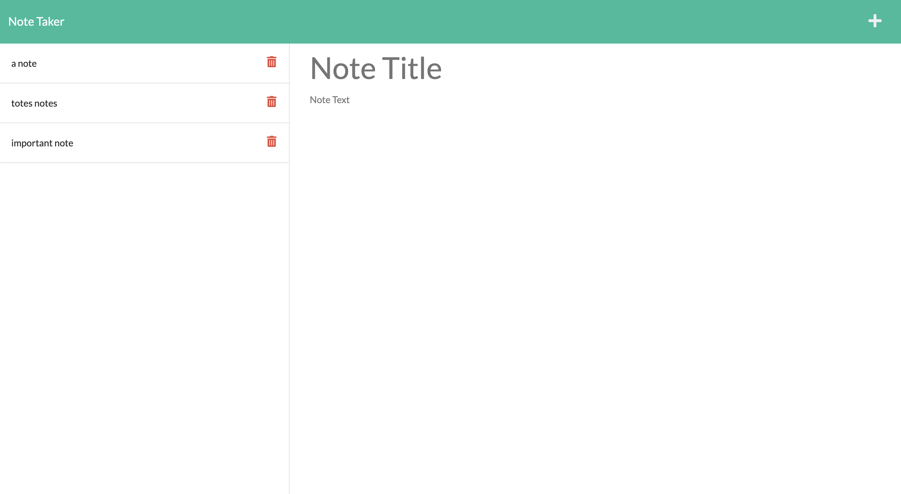

# note-taker
An express.js note taker application
  

  ## Description 

  This note taker application allows the user to add new notes with a title and body and save to a list of deletable notes. When a particular note is clicked on, it is displayed again on the right side. 

  ## Table of Contents
  * [Installation](#installation)
  * [Usage](#usage)
  * [License](#license)
  * [Contribute](#contribute)
  * [Tests](#tests)
  * [Questions](#questions)
  
  ## Installation 

  Clone this repository, run npm install to install all dependencies.

  `npm install`

  Run.

  `npm start`

  ## Usage 
  
  Visit the Heroku link to see the deployed application.

  ## License

  This project is under the MIT license.

  ## Contribute

  Contributors can clone the repository and reach out through the contacts provided in the Questions section.

  ## Questions

  For any questions about this project, please contact me at kenneth.maclean84@gmail.com. 

  Visit https://github.com/DoshPocket to access more of my projects.

  
  